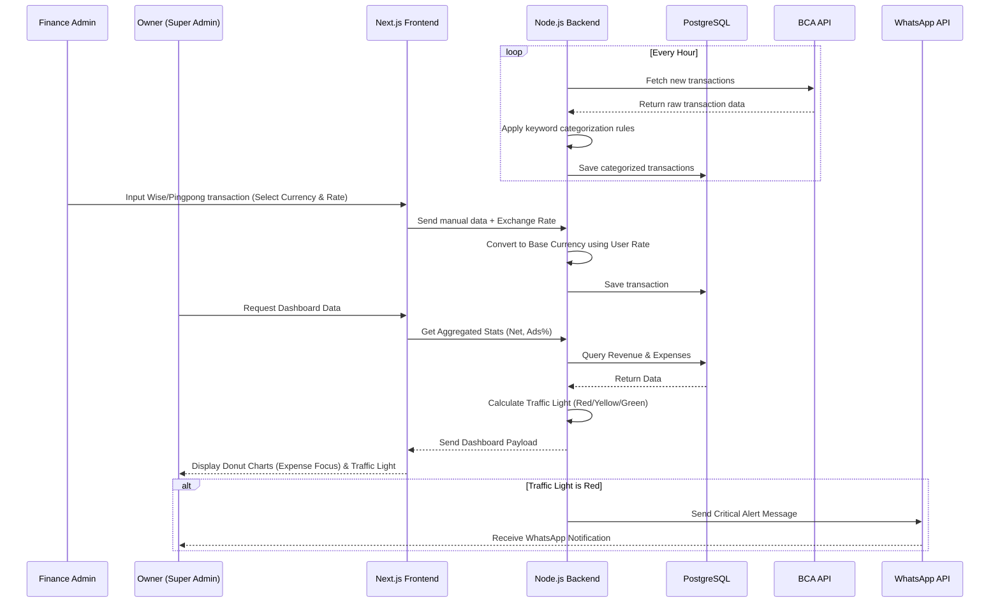
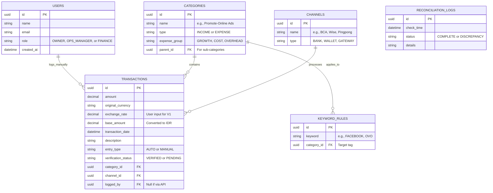

# PRD — Project Requirements Document

## 1. Overview
**O-REIO** is a centralized financial capability module designed to track expenses, manage income streams, and monitor the profitability of a multi-channel business. The business receives income from various streams (Wholesale, Consignments, Shopify, TikTok, Offline Store) and handles multiple expenses ranging from office salaries to digital advertising. 

Currently, financial data is scattered across automated bank feeds (BCA API) and manual gateways (Pingpong, Wise, Aspire). O-REIO solves this by consolidating all transactions into one unified dashboard, applying smart auto-categorization based on keywords, and supporting multi-currency entries (Manual V1). The primary objective is to give the business owner a clear, real-time "Traffic Light" indicator on profitability—answering the critical operational question: *"Are we financially healthy enough to scale our ads and business today?"*

## 2. Requirements
- **User Roles:** 
  - **Owner / Super Admin:** Full access to all dashboards, net profit calculation, and the profitability traffic light system.
  - **Operations Manager:** Read-only management access. Can view all dashboards, reports, and reconciliation status but cannot edit, delete, or configure rules.
  - **Finance / Admin Staff:** Restricted access focused strictly on manual data entry, transaction reconciliation, currency rate input, and basic reporting.
- **Data Sync:** Automated data pulls via BCA API running hourly. 
- **Categorization Logic:** Keyword-based rules to automatically sort transactions (e.g., "Facebook" automatically maps to "Growth > Promote-Online Ads").
- **Multi-Currency Support (V1):** Manual handling for transactions coming from platforms like Wise, Aspire, and Pingpong. Users must select the original currency and input the exchange rate manually during entry to convert to base currency IDR.
- **Integrations:** Needs to link with the existing internal modules: `o-signia` report module and the `wholesale` module.
- **Alerts:** In-app notifications and **WhatsApp messages** to update the Owner when profitability thresholds enter warning or critical states.

## 3. Core Features
- **Dynamic Financial Dashboard:** Daily and monthly views featuring rich visuals. **Donut Graphs must specifically focus on Expense Breakdown** (visualizing the split between Growth, Cost, and Overhead) to highlight burn rate efficiency.
- **Smart Categorization Engine:** A backend rule builder where admins can assign keywords to expense categories. 
  - *Example Correction:* "OVO" maps to "Overhead > Shipping Grab".
  - *Example Correction:* "Salary" maps to "Cost > Office Salaries".
  - Ensures consistent grouping across Growth, Cost, and Overhead.
- **Profitability Traffic Light System:** A custom calculation widget on the Super Admin dashboard that calculates:
  - **NET** = `Total Revenue` - `Total Expense` (Growth, Cost, Overhead)
  - **ADS (%)** = `Growth Expense` / `Total Revenue`
  - 🟢 **Green (< 15%):** Healthy and scalable.
  - 🟡 **Yellow (15–25%):** Okay, but must optimize. Stop scaling temporarily.
  - 🔴 **Red (> 25%):** Unsafe. Buying revenue too expensively. Danger even if NET is positive.
  - **Alert Action:** If Red 🔴, trigger WhatsApp alert to Owner.
- **Reconciliation & Data Completeness:** A core feature status check that verifies BCA API pulls match expected bank statement totals and flags any manual entries that remain unverified. Ensures data integrity before financial decisions are made.
- **Omni-Channel Manual Input:** Easy-to-use forms for finance staff to log incomes/expenses from non-BCA channels (Pingpong, Wise, Aspire). Users must manually select the currency (USD/SGD) and input the exchange rate for conversion to base currency IDR.
- **Reporting & Graphing:** Line/Bar charts showing historical revenue vs. expenses to track the trajectory of the business over time.

## 4. User Flow
1. **Automated Sync (Background):** Every hour, the O-REIO system pings the BCA API, downloads recent transactions, and assigns them to the correct categories using keyword formulas.
2. **Manual Entry (Finance Staff):** The Finance Admin logs into O-REIO, navigates to the "Manual Inputs" tab, and adds Shopify income from Pingpong (in USD) or Wholesale income from Wise. **The Admin manually selects the currency and inputs the exchange rate** for conversion to IDR.
3. **Reconciliation Check (System/Finance):** The system flags any discrepancies between API pulls and bank statements. Finance Staff verifies unverified manual entries to ensure Data Completeness.
4. **Dashboard Access (Owner/Ops Manager):** The Owner or Operations Manager logs in and instantly sees the Daily Dashboard (Read-only for Ops Manager).
5. **Data Visualization:** The Owner looks at the Donut Graph to see specifically where expenses were allocated (Growth vs. Cost vs. Overhead).
6. **Decision Making:** The Owner looks at the **Traffic Light Module**. 
   - If Green 🟢 and Net is positive: Message marketing team to scale Facebook Ads.
   - If Red 🔴: System sends **WhatsApp Alert** to Owner. Owner initiates cost-cutting or optimization measures.

## 5. Architecture
O-REIO relies on a modern client-server architecture. The backend manages scheduled Cron Jobs to trigger the hourly BCA API fetch. Keyword rules are applied at the backend level before saving to the database. The frontend requests this formatted data and renders the interactive dashboard. Currency conversion for manual entries is handled via user input rather than external API calls in V1.

## 6. Database Schema
To support custom rules, multi-channel inflows, hierarchical categories, and manual reconciliation, the database relies on the following key structures:

*   **Users**: Stores user credentials and role-based access controls (including Operations Manager).
*   **Transactions**: The core ledger table containing all incoming and outgoing money.
*   **Categories**: A hierarchical setup (e.g., Parent: "Online Ads", Child: "Facebook Ads").
*   **Channels**: The payment gateway or bank account (BCA, Pingpong, Wise).
*   **KeywordRules**: Mapping logic that tells the system how to auto-tag BCA bank statements.
*   **ReconciliationLogs**: Tracks status of data completeness and verification.

## 7. Tech Stack
Based on the operational requirements, user preferences, and standard modern web practices:

- **Frontend:** Next.js (React framework) for fast loading and seamless routing.
- **Styling & UI:** **Vercel-inspired design aesthetic.** Utilize Tailwind CSS combined with shadcn/ui to achieve a clean layout, high-contrast typography, and minimalist execution. **Dark mode support** must be implemented as a standard design language. The UI should focus on **high information density** with a premium, developer-centric feel. Chart.js or Recharts will be used for the Donut Graphs (Expense Focus) and financial line charts, styled to match this aesthetic.
- **Backend:** Node.js (via Express or integrated directly into Next.js API routes) to handle integrations and business logic.
- **Database:** PostgreSQL for robust, relational financial data storage.
- **ORM (Object-Relational Mapper):** Drizzle ORM or Prisma to safely interact with PostgreSQL.
- **Background Jobs:** Node-cron or BullMQ directly on Node.js to trigger the highly reliable "Hourly Sync" with the BCA API.
- **Notifications:** WhatsApp Business API integration for critical alerts.
- **Deployment:** VPS (Virtual Private Server) such as DigitalOcean or AWS EC2, provisioned with Docker and NGINX for secure, managed hosting.ß
